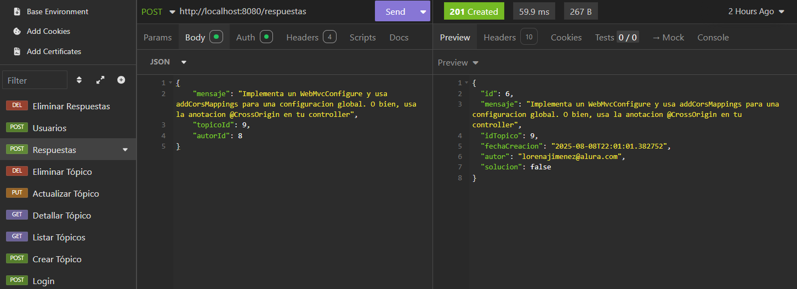
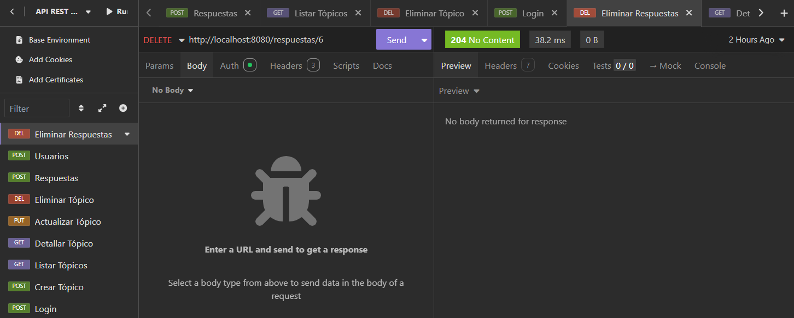

# Foro Hub - Mi Primer API REST

¡Hola! Soy estudiante de programación y este es mi proyecto del **Challenge Back End** de Alura LATAM. 

Es mi primera API REST completa y estoy súper emocionado de compartirla contigo. Si también eres principiante como yo, espero que este proyecto te sirva de inspiración!







## ¿Qué hace este proyecto?

Básicamente, hice una API que simula un foro como el de Alura. Los usuarios pueden:

- Crear preguntas (tópicos)
- Ver todas las preguntas
- Responder preguntas de otros
- Editar sus propias preguntas  
- Borrar preguntas
- Todo con un sistema de login seguro

## ¿Cómo se ve?

Como es una API, no tiene interfaz gráfica bonita, pero puedes probarla en:
- **Swagger**: http://localhost:8080/swagger-ui.html (cuando la ejecutes)
- **Postman** o **Insomnia** 


## ¿Qué tecnologías usé?

Como principiante, elegí estas tecnologías porque son las que aprendí en Alura:

- **Java 21**: El lenguaje de programación
- **Spring Boot**: Framework que hace todo más fácil  
- **PostgreSQL**: Base de datos (también funciona con MySQL)
- **JWT**: Para hacer el login seguro
- **Maven**: Para manejar las librerías
- **Swagger**: Para documentar la API automáticamente

## ¿Cómo ejecutar mi proyecto?

### Cosas que necesitas instalar primero:

1. **Java 21** - [Descargar aquí](https://adoptium.net/)
2. **PostgreSQL** - [Descargar aquí](https://www.postgresql.org/download/)
3. **Git** - [Descargar aquí](https://git-scm.com/)
4. Un IDE como **IntelliJ IDEA** **VS Code**

**1. Descarga el proyecto:**
```bash
git clone https://github.com/glenisc08/Challenge-Foro-Hub.git
cd Challenge-Foro-Hub
```

**2. Crea la base de datos:**
- Abre PostgreSQL
- Crea una base de datos llamada `forohub`
```sql
CREATE DATABASE forohub;
```

**3. Configura la aplicación:**
- Copia el archivo `application-example.properties`  
- Renómbralo a `application.properties`
- Cambia estos valores por los tuyos:

```properties
# Cambia estos datos por los tuyos
spring.datasource.url=jdbc:postgresql://localhost:5432/forohub
spring.datasource.username=tu_usuario_de_postgres  
spring.datasource.password=tu_contraseña_de_postgres
api.security.secret=mi_clave_super_secreta_123
```

**4. Ejecuta el proyecto:**

Si usas **IntelliJ IDEA**:
- Abre el proyecto 
- Ve al archivo `ForohubApplication.java`
- Haz clic en el botón verde

**5. ¡Listo!**
- Ve a: http://localhost:8080/swagger-ui.html
- Ahí podrás probar todos los endpoints

## ¿Cómo usar la autenticación?

**1. Primero tienes que hacer login:**
- Ve a `/login` en Swagger
- Usa estos datos de prueba:
```json
{
  "login": "admin", 
  "clave": "123456"
}
```

**2. Te va a devolver un token así:**
```json
{
  "jwtToken": "eyJhbGciOiJIUzI1NiIsInR5cCI6IkpXVCJ9..."
}
```

**3. Copia ese token y:**
- En Swagger: Haz clic en "Authorize" y pega: `Bearer tu_token_aquí`
- En Insomnia: Ve a Auth → Bearer Token y pega el token`


## ¿Qué puedes hacer con la API?

### Crear un tópico:
```json
POST /topicos
{
  "titulo": "¿Cómo conectar a una base de datos?",
  "mensaje": "Ayuda, no logro conectar mi app Spring Boot con PostgreSQL",
  "curso": "Spring Boot"
}
```

### Ver todos los tópicos:
```json
GET /topicos
```

### Responder a un tópico:
```json
POST /respuestas  
{
  "mensaje": "Tienes que configurar el application.properties...",
  "topicoId": 1
}
```

## Problemas que tuve (y cómo los solucioné)

**Error más común que me pasó:**
- **Problema**: `Connection refused to database`
- **Solución**: Verificar que PostgreSQL esté ejecutándose y que los datos en `application.properties` sean correctos

**Swagger no carga:**
- **Problema**: Error 404 en swagger-ui
- **Solución**: Usar la URL correcta: `http://localhost:8080/swagger-ui.html`

**JWT no funciona:**
- **Problema**: 403 Forbidden en endpoints
- **Solución**: Verificar que el token esté en el formato: `Bearer espacio token`

## Recursos que me ayudaron

- [Curso de Spring Boot en Alura](https://www.aluracursos.com/)
- [Documentación oficial de Spring Boot](https://spring.io/projects/spring-boot)
- [JWT.io](https://jwt.io/) - Para entender los tokens
- [Stack Overflow](https://stackoverflow.com/) - Para resolver errores raros

  
## Bugs conocidos (sí, los hay)

- A veces el token expira y no da un error claro
- No validé que un usuario no pueda editar tópicos de otros ni eliminarlos
- Falta paginación en algunos endpoints

## ¿Me ayudas a mejorar?

Si eres más experimentado que yo y ves algo que se puede mejorar, ¡me encantaría tu feedback!

Puedes:
- Crear un **Issue** si encuentras un bug
- Hacer un **Pull Request** con mejoras
- Escribirme para dar sugerencias

## Contacto

- **GitHub**: [@glenisc08](https://github.com/glenisc08)
- **LinkedIn**: www.linkedin.com/in/glenis-corona-19101332a


---

⭐ Si este proyecto te sirvió de algo, ¡dale una estrella! Me motivaría muchísimo para seguir aprendiendo.
